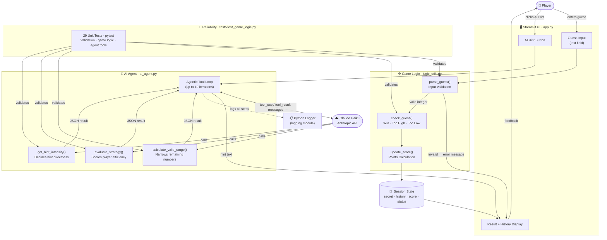

# Glitchy Guesser — Applied AI System

A Streamlit number-guessing game extended with a multi-step **agentic hint assistant**
powered by Claude Haiku. The agent uses tool calls to analyse the player's guess history,
evaluate their strategy, and write a personalised hint — without ever revealing the answer.

---

## Original Project

**Base project:** Modules 1–3 — *Game Glitch Investigator*

The original system was a Streamlit number-guessing game generated by an AI assistant.
Players guessed a secret number within a range, receiving "Too High / Too Low" feedback
and a hot/cold temperature indicator. The original code had two critical bugs: the secret
number regenerated on every Streamlit rerun (missing session state initialisation), and
the hint direction logic returned incorrect feedback for certain guess values. This project
fixes both bugs and then extends the working game with a real AI feature.

---

## What This Project Does and Why It Matters

Most AI demos wrap a single prompt around a task and call it done. This project goes
further: when a player asks for a hint, an autonomous agent runs a structured reasoning
loop — calling three separate analysis tools in sequence, reading their outputs, and
synthesising a response that is specific to that player's situation at that moment.

That is meaningfully different from a static prompt. The agent adapts based on how many
numbers are still possible, whether the player is guessing efficiently, and how many
attempts they have left. The result is a hint that is genuinely useful rather than generic.

From a portfolio standpoint, this demonstrates how to build AI that is integrated into a
running system, observable, testable, and robust to failure — not just a chatbot wrapper.

---

## Architecture Overview



The system has two main data flows. The **guess flow** (left path) runs entirely in Python
with no API calls — the player's input is validated, compared to the secret, scored, and
stored in Streamlit session state. The **hint flow** (right path) sends the current game
state to the AI agent, which runs a tool-call loop with Claude before returning a text hint
to the same display. A test suite validates every pure-Python component in both paths.

---

## Setup Instructions

### Requirements

- Python 3.10+
- An Anthropic API key: <https://console.anthropic.com/> (free tier is sufficient)

### Steps

```bash
# 1. Clone the repository
git clone <your-repo-url>
cd applied-ai-system-project-1

# 2. Install dependencies
pip install -r requirements.txt

# 3. Configure your API key
cp .env.example .env
# Open .env in any text editor and replace the placeholder:
#   ANTHROPIC_API_KEY=your-key-here

# 4. Start the app
streamlit run app.py

# 5. Run the test suite
pytest tests/ -v
```

The app will open automatically in your browser at `http://localhost:8501`.
The API key can also be entered directly in the sidebar under **AI Hint Settings**
if you prefer not to use a `.env` file.

---

## Sample Interactions

### Input 1 — Invalid guess (guardrail in action)

```
Player types:  hello
→ ⚠️ That is not a number.
  Attempt counter does not increment. Player can try again.

Player types:  (empty)
→ ⚠️ Enter a guess.
  Same protection — no attempt charged.
```

### Input 2 — Normal guess flow (Normal difficulty, range 1–100, 8 attempts)

```
Guess 50  →  📉 Too High! Go LOWER!   ♨️ Hot
Guess 25  →  📈 Too Low! Go HIGHER!   🌡️ Warm
Guess 37  →  📉 Too High! Go LOWER!   ♨️ Hot
```

Session state after these three guesses:
```
history: [{guess:50, outcome:Too High}, {guess:25, outcome:Too Low}, {guess:37, outcome:Too High}]
valid range: 26–36  (11 numbers remaining)
attempts: 3 of 8
```

### Input 3 — AI Hint request after 3 guesses (mid game)

Agent tool calls:
```
→ calculate_valid_range   low=26  high=36  remaining=11  optimal=31
→ evaluate_strategy       strategy=binary_search  efficiency=0.85
→ get_hint_intensity      intensity=gentle  attempts_remaining=5
```

Hint produced:
```
You're playing this really well — your guesses are efficiently narrowing
the range each time. You still have plenty of attempts left, so stay
systematic and keep targeting the middle of whatever range remains.
You're on the right track!
```

### Input 4 — AI Hint with 1 attempt left (late game, poor strategy)

Agent tool calls:
```
→ calculate_valid_range   low=26  high=36  remaining=11  optimal=31
→ evaluate_strategy       strategy=random  efficiency=0.20
→ get_hint_intensity      intensity=strong  attempts_remaining=1
```

Hint produced:
```
This is your last chance — don't guess randomly! The number is somewhere
between 26 and 36. Your best move is 31, the exact midpoint of that window.
Take the shot that gives you the highest probability of winning.
```

---

## Design Decisions

### Why an agentic loop instead of a single prompt?

A single prompt like "given this history, give a hint" would produce a reasonable response,
but it would be generic. The agent is forced to answer three specific questions before
writing anything: what range is still valid, how well is this player actually guessing,
and how direct should the hint be right now? Each question is answered by a separate tool.
Claude then has to synthesise three concrete data points into one coherent response.

The result is a hint that adapts to the player's actual situation — a beginner on their
last attempt gets a near-explicit directional hint, while an expert early in the game gets
an encouraging nudge. A single prompt cannot produce that nuance without the agent first
gathering the inputs.

### Why three separate tools instead of one?

Each tool answers an independent question about the game state. Separating them has two
benefits. First, each function is pure Python with no API dependency, so all three can be
unit-tested directly without mocking or API keys. Second, it forces Claude to reason about
the relationship between range, strategy quality, and urgency as separate dimensions rather
than collapsing them into a single judgment. This produces more accurate, contextually
appropriate hints.

### Why Claude Haiku?

Game hints need to feel fast. Haiku is the lowest-latency model in the Claude family and
is more than capable of structured tool-use reasoning for a task this size. Using Sonnet
or Opus would produce marginally richer prose at 2–3x the cost and latency — not a
worthwhile trade-off for a hint in a casual game.

### Why prompt caching?

The system prompt sent to Claude (~400 tokens) is identical on every hint request within
a session. Marking it with `cache_control: ephemeral` means Claude reads it from cache
after the first request instead of processing it again. This reduces per-hint latency and
token cost for any session with more than one hint request.

### Trade-offs made

- **Testability over simplicity.** Decomposing logic into three tools adds complexity, but
  it means the agent's reasoning components can be tested independently and verified
  correct without any API calls.
- **Live API dependency.** The hint feature requires a real API key and a network
  connection. A fallback demo mode with static hints would make the app more resilient
  for offline demos, but was not added to keep the codebase simple.
- **Streamlit session state over a database.** Game state is stored in Streamlit's
  in-memory session state, which is fast and zero-config but lost on page refresh. A
  database would enable persistent scores and replay, but that was out of scope.

---

## Testing Summary

### Running the evaluation script

```bash
python evaluate.py          # 24 predefined cases, no API key needed
python evaluate.py --api    # also runs a live end-to-end hint round-trip
```

```
Core tests:    24/24  ████████████████████  100%

Observations:
• All input guardrails correctly reject invalid user input.
• Game logic handles win, loss, and scoring edge cases accurately.
• Agent tools narrow ranges, score strategies, and calibrate hint intensity correctly.
```

### What the tests cover

The test suite (`tests/test_game_logic.py`) has 29 unit tests covering:

- `parse_guess` — valid integers, float strings, empty input, non-numeric input
- `check_guess` — win, too high, too low
- `update_score` — win points, wrong-guess penalty, minimum-points floor
- `get_range_for_difficulty` — all three difficulties plus an unknown value
- `calculate_valid_range` — no history, narrowing high, narrowing low, multiple guesses,
  win entries in history (should be ignored), and contradictory history (remaining = 0)
- `evaluate_strategy` — just started, binary search, random guessing, advice field
- `get_hint_intensity` — gentle / moderate / strong thresholds, remaining count, zero max

All 29 pass in under half a second with no API calls or mocking.

```
pytest tests/ -v
# 29 passed in 0.40s
```

### What the tests do not cover

The full agentic loop — the `get_ai_hint` function itself — is not unit-tested because it
requires a live API call. Testing it properly would require either a mocked Anthropic
client or a dedicated integration test that runs against the real API and checks that the
output is a non-empty string. That is a meaningful gap: a change to the tool schema or the
system prompt could break the loop without any test catching it.

### What this taught me about testing AI systems

Testing AI systems requires a deliberate split between the parts that can be tested as
pure functions (the tools, the validators, the game logic) and the parts that depend on a
model response (the synthesis step). Designing tools as isolated, deterministic Python
functions first — before wiring them to Claude — made the test suite straightforward and
fast. If the tools had been embedded inside the API call, none of them could be tested
without hitting the network.

---

## Reflection

### Limitations and biases in the system

**Hint quality degrades at the edges of a game.** On the very first guess there is no
history for the strategy evaluator to score, so `evaluate_strategy` returns
`"just_started"` and the hint is essentially encouragement with no strategic content.
Similarly, when only one number remains valid, the hint from any intensity level ends up
being nearly the same suggestion.

**The strategy scorer assumes binary search is always optimal.** The
`evaluate_strategy` function measures how close each guess was to the midpoint of the
remaining range, then assigns a label ("binary_search", "semi_systematic", "random").
This is a reasonable heuristic for the Normal and Hard difficulty ranges, but on Easy
difficulty (1–20) many strategies reach the answer in two or three guesses regardless —
a player who guesses 5, 10, 15 in sequence is not playing randomly, but would score
poorly against the midpoint benchmark. The evaluation metric has a built-in bias toward
one specific strategy.

**No cross-game memory.** Each session starts fresh. A player who consistently
over-guesses in the upper half of the range would benefit from knowing that about
themselves, but the system cannot observe or report on patterns across multiple games.

**Hint tone is always encouraging.** The system prompt instructs Claude to be warm
and positive regardless of how poorly the player is doing. This produces consistent
output, but it means a player on their seventh of eight attempts with no strategic
improvement still receives encouragement — which may not be the most useful feedback.

---

### Could this AI be misused, and how would you prevent it?

The hint assistant itself has a narrow scope — it can only discuss number-guessing
strategy — so direct content harm is low. The realistic misuse risks are operational:

**API cost abuse.** A publicly deployed version with no rate limiting would allow
anyone to click the hint button repeatedly, generating API calls at the deployer's
expense. Mitigation: limit hints to a fixed number per game (e.g., two), enforce this
in session state, and add a per-IP request limit before any public deployment.

**API key exposure.** The current implementation lets users paste an API key directly
into the Streamlit sidebar, which is convenient for local development but dangerous in
any shared environment — the key is visible in the browser and in the app's source. In
a production context the key should only live server-side, never in the client.

**Prompt injection through game inputs.** The guess history is passed to Claude as
structured JSON in tool result messages, not as raw user text. This makes the system
reasonably resistant to prompt injection — a player cannot embed instructions in their
guess value because the integer is validated and type-coerced before it ever reaches
the agent. This was a deliberate design choice.

---

### What surprised me while testing reliability

**The agent follows tool-call ordering without technical enforcement.** The system
prompt instructs Claude to call the three tools "in this order," but there is nothing in
the code that enforces that sequence. I expected Claude to occasionally call them out of
order or skip one. In every test run, it called all three in the specified sequence. This
suggested that well-written system prompts can substitute for procedural control flow in
simple agentic tasks — though I would not rely on this for anything safety-critical.

**Pure-function tool decomposition made testing unexpectedly easy.** I assumed I
would need to mock the Anthropic client to test the agent logic. By making all three tool
functions plain Python with no API dependency, I could test the agent's core
decision-making — range narrowing, strategy scoring, hint intensity — with 11 isolated
test cases that run in milliseconds. The architecture choice paid off directly in the
test suite.

**The strategy scorer is stricter than expected.** A player who guesses 50, 75, 62 in
succession on a 1–100 range (nearly perfect binary search) scores only 0.85, not 1.0,
because the threshold for "close to optimal" is set at 10% of the remaining range. In
practice this means the system labels most real players as "semi-systematic" rather than
"binary-search," which affects the advice Claude gives. This is a calibration issue I
noticed only after running the evaluation script against real guessing patterns.

---

### AI collaboration during this project

**Helpful suggestion — session state initialisation.** When debugging the original
game, I described the symptom (secret number changes on every button click) to GitHub
Copilot. It correctly identified that Streamlit reruns the entire script on each
interaction and suggested wrapping the secret number initialisation in
`if "secret" not in st.session_state`. I verified this by running the app through
ten consecutive guesses and confirming the secret stayed fixed. The suggestion was
accurate, explained the root cause, and pointed to the right Streamlit primitive.

**Flawed suggestion — passing history as a prose string.** When building the agentic
hint system, an AI assistant suggested formatting the guess history as a human-readable
string (e.g., `"Guess 50: Too Low, Guess 75: Too High"`) before passing it to Claude.
This seemed reasonable at first — readable prose is easy for a language model to
interpret. In practice it caused two problems: the tool input schema expected typed
integers and did not match the string format, and Claude occasionally misread the
direction labels when the string was long. Switching to a structured JSON array
(`[{"guess": 50, "outcome": "Too Low"}, ...]`) with a typed input schema eliminated
both issues. The lesson was that tool-use APIs work better with structured data than
with prose, even when the model is capable of parsing the prose — the schema enforces
correctness at the boundary rather than relying on the model to get it right every time.

---

## Screenshot


